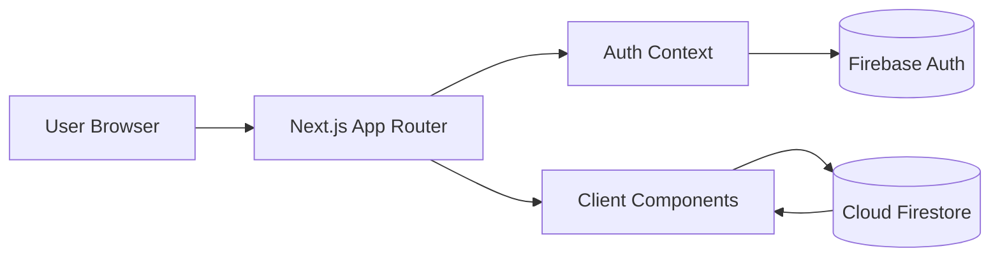

# StudyHub

<p align="center">
  
</p>

<p align="center">
  A focused study workspace for topics, tasks, reminders, and notes.
</p>

<p align="center">
  <a href="https://study-hub-app.vercel.app"></a>
  <a href="https://nextjs.org"></a>
  <a href="https://www.typescriptlang.org/"></a>
  <a href="https://firebase.google.com/"></a>
  <a href="https://tailwindcss.com/"></a>
</p>

---

## Product Snapshot

StudyHub is a topic-first productivity app designed for students and self-learners who need structure without clutter.

- Topic-centered workspace
- Real-time task and reminder tracking
- Shareable public topic links
- Mobile-friendly interaction model
- Warm and dark visual themes

---

## Core Features

| Area | What you get |
| --- | --- |
| Topics | Dedicated dashboards per subject with quick switching |
| Tasks | Priority levels, due dates, tags, completion tracking |
| Reminders | Scheduled reminder timeline with status filtering |
| Notes | Topic-scoped notes with tags |
| Sharing | Public topic links and deep links to specific tasks |
| UI/UX | Responsive layout, subtle animation system, theme toggle |

---

## Architecture (High Level)



---

## Tech Stack

- Framework: Next.js 15 + React 18
- Language: TypeScript
- Styling: Tailwind CSS
- Backend: Firebase Auth + Firestore
- Validation: Zod + React Hook Form
- Deployment: Vercel

---

## Local Setup

### 1. Clone and install

```bash
git clone https://github.com/Anish-2005/StudyHub.git
cd StudyHub
npm install
```

### 2. Environment variables

Create `.env.local` and add:

| Variable |
| --- |
| `NEXT_PUBLIC_FIREBASE_API_KEY` |
| `NEXT_PUBLIC_FIREBASE_AUTH_DOMAIN` |
| `NEXT_PUBLIC_FIREBASE_PROJECT_ID` |
| `NEXT_PUBLIC_FIREBASE_STORAGE_BUCKET` |
| `NEXT_PUBLIC_FIREBASE_MESSAGING_SENDER_ID` |
| `NEXT_PUBLIC_FIREBASE_APP_ID` |
| `NEXT_PUBLIC_FIREBASE_MEASUREMENT_ID` |

### 3. Run

```bash
npm run dev
```

Open `http://localhost:3000`.

---

## Scripts

```bash
npm run dev      # start local dev server
npm run lint     # run ESLint
npm run build    # production build
npm run start    # run built app
```

---

## Deployment

The app is configured to deploy on Vercel.

Recommended checklist before deploy:

1. Ensure Firebase rules are up to date.
2. Add all required env vars in Vercel project settings.
3. Run `npm run lint` and `npm run build`.
4. Verify `robots.txt` and `sitemap.xml` are reachable after deploy.

---

## SEO

StudyHub includes:

- Canonical metadata
- Open Graph + Twitter metadata
- Structured data (`WebSite` + `SoftwareApplication`)
- Dynamic metadata for public topic pages
- Generated `robots.txt` and `sitemap.xml`

---

## Security Notes

- Firestore rules should enforce per-user data access.
- Public sharing is topic-scoped and read-only.
- Do not commit private keys or server secrets.

---

## Contributing

Please read [CONTRIBUTING.md](./CONTRIBUTING.md) before opening a PR.

---

## License

This project is licensed under the MIT License. See [LICENSE](./LICENSE).
